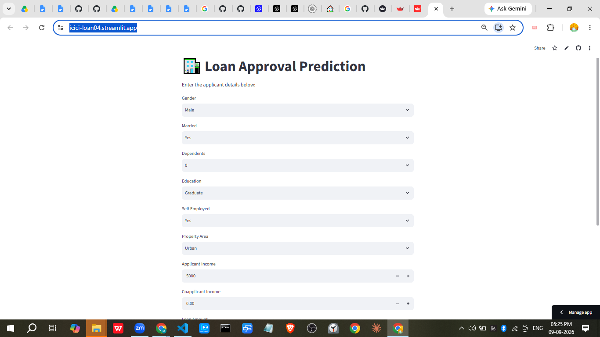

# Loan Approval Prediction

A machine learning web application that predicts whether a loan application is likely to be approved. The project uses a trained scikit-learn pipeline and provides an interactive Streamlit interface for entering applicant details.

## Live Demo

[Open the Loan Approval Prediction app](https://icici-loan04.streamlit.app/)

## Project Screenshot



> The screenshot file is currently named `dashbord.png` in the `img` folder.

## Features

- Interactive Streamlit prediction form
- Handles categorical and numerical applicant information
- Preprocesses inputs with the same pipeline used during training
- Predicts loan approval or rejection
- Displays the result directly in the browser

## Input Fields

The application accepts:

- Gender
- Marital status
- Number of dependents
- Education
- Self-employment status
- Applicant and coapplicant income
- Loan amount
- Loan term
- Credit history
- Property area

## Machine Learning Workflow

The notebook `dataclean.ipynb` contains the main workflow:

1. Load the loan dataset
2. Inspect and fill missing values
3. Remove the `Loan_ID` column
4. Encode the target column, `Loan_Status`
5. Split the data into training and testing sets
6. Encode categorical features and scale numeric features
7. Train a logistic regression model
8. Evaluate the model with classification metrics
9. Save the trained pipeline as `final_model.pkl`

## Project Structure

```text
loan_approval_prediction_ml/
├── app.py                 # Streamlit application
├── dataclean.ipynb        # Data cleaning, training, and evaluation workflow
├── final_model.pkl        # Saved trained scikit-learn pipeline
├── loan_data_set.csv      # Loan application dataset
├── img/
│   └── dashbord.png       # Application screenshot
├── requirements.txt       # Python dependencies
└── README.md
```

## Run Locally

### 1. Clone the repository

```bash
git clone <your-repository-url>
cd loan_approval_prediction_ml
```

### 2. Install dependencies

```bash
pip install -r requirements.txt
```

### 3. Start the Streamlit app

```bash
streamlit run app.py
```

The application will be available at `http://localhost:8501`.

## Technologies

- Python
- Pandas
- NumPy
- scikit-learn
- Streamlit
